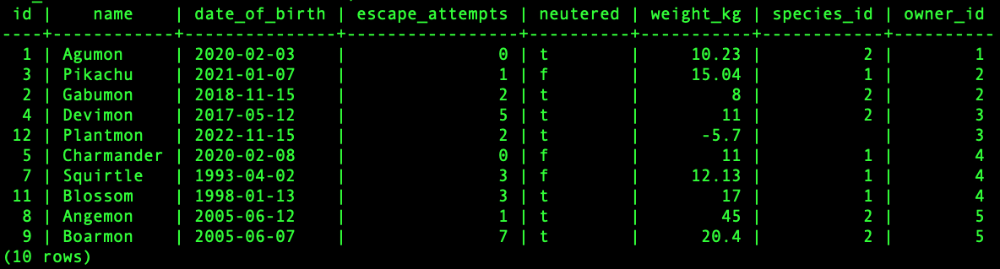
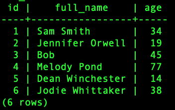
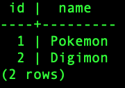

# Vet Clinic

## About

Interacting with a relational database using postgresql with case based query examples.


### Animals Table



### Owners Table



### Species Table



## Tools

- Bash Terminal
- PosgreSql App
- SQL

## Getting Started

To get a local copy; follow the below steps.

### Prerequisites

If you are not familiar to use terminal, please check this [article](https://www.theodinproject.com/courses/web-development-101/lessons/command-line-basics-web-development-101)

### Setup

Open your terminal and run the following commands on your terminal.

### Install

To get a local copy of the repository, run the following commands on your terminal.

```
cd <your_desktop>
```

```
git clone https://github.com/yigitm/vet-clinic
```

```
cd vet-clinic
```

### Usage

You can find database table schema in below file.

```
schema.sql
```

You can find inserted datas in below file.

```
data.sql
```

You can find data queries in 'queries.sql' for the below cases.

```
 - Find all animals whose name ends in "mon".
 - List the name of all animals born between 2016 and 2019.
 - List the name of all animals that are neutered - and have less than 3 escape attempts.
 - List date of birth of all animals named either "Agumon" or "Pikachu".
 -List name and escape attempts of animals that weigh more than 10.5kg
 - Find all animals that are neutered.
 - Find all animals not named Gabumon.
 - Find all animals with a weight between 10.4kg and 17.3kg (including the animals with the weights that equals precisely 10.4kg or 17.3kg)
```

## Author

👤 **Yigit Mersin**

- GitHub: [@github](https://github.com/ygtmrsn)
- LinkedIn: [@linkedIn](linkedin.com/in/yigitmersin)
- Twitter: [@twitter](https://twitter.com/ygtmrsn)

## 🤝 Contributing

Contributions, issues, and feature requests are welcome!

Feel free to check the [issues page](https://github.com/yigitm/vet-clinic/issues).

## Show your support

Give a ⭐️ if you like this project!

## Acknowledgments

- [Microverse](https://www.microverse.org/)
- [PostGreSQL](https://www.postgresql.org/)
- [Open Source](https://en.wikipedia.org/wiki/Open_source)

## 📝 License

This project is [MIT](./MIT.md) licensed.
